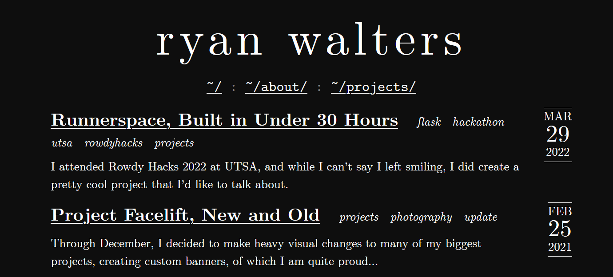

# xevion.dev

<div align="center">
    <a href="https://xevion.dev"></a>
    <br>
    <sub>
        Built with ❤︎ by <a href="https://github.com/Xevion/">Xevion</a>
    </sub>
</div>

A jekyll-based static blog for my personal usage. Styling originally by [Delan Azabani](https://github.com/delan/www.azabani.com).

## Usage

```
bundle install
bundle exec jekyll serve --config _config.yml,_config_dev.yml
bundle exec jekyll build
```